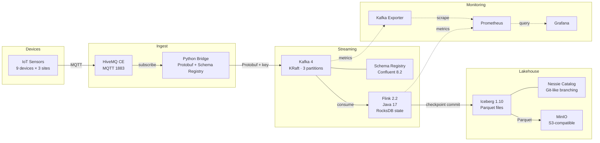

# IoT Lakehouse — Flink + Iceberg

End-to-end streaming lakehouse for IoT telemetry: MQTT sensors feed Kafka via a Schema Registry bridge, Flink streams the data into Apache Iceberg tables on S3-compatible storage, queryable from any SQL engine.

## Architecture



**Data flow:** Simulated IoT devices publish JSON readings over MQTT to HiveMQ. A Python bridge subscribes, serializes to Protobuf via Schema Registry, and produces to Kafka (keyed by `device_id`). Flink consumes the Protobuf stream with `read_committed` isolation and event-time watermarks, strips the Confluent wire-format header, parses with the generated Java class, maps records to Iceberg RowData, and sinks Parquet files to MinIO through the Nessie catalog. State is managed by RocksDB with S3-backed checkpoints — every successful checkpoint triggers an Iceberg commit, giving exactly-once delivery to the table. Prometheus scrapes Flink and Kafka metrics; Grafana provides pre-provisioned dashboards for lag, throughput, and checkpoint health.

## Run the full pipeline locally

**Prerequisites:** Docker (with Compose), Java 17, Maven, Python 3.10+, `grpcio-tools` (`pip install grpcio-tools`).

```bash
# 1. Start the stack (healthchecks gate start order; kafka-init creates topics; minio-init creates bucket)
cd docker && docker compose up -d

# 2. Build the Flink fat jar (also generates Java Protobuf classes)
cd ../flink-jobs && MAVEN_OPTS="-Xmx3g" mvn clean package -DskipTests

# 3. Install Python dependencies and generate Protobuf stubs
cd ../sample-data && pip install -r requirements.txt
cd .. && bash scripts/gen_proto.sh

# 4. Start the simulator and bridge (two terminals)
cd sample-data
python3 sensor_simulator.py --rate-hz 5
python3 mqtt_kafka_bridge.py

# 5. Submit the Flink job (append mode; or use KafkaToIcebergUpsertJob for upsert)
docker cp ../flink-jobs/target/iot-lakehouse-flink-0.1.0-SNAPSHOT.jar \
  docker-flink-jobmanager-1:/tmp/job.jar
docker exec docker-flink-jobmanager-1 flink run -d /tmp/job.jar
```

After ~30 seconds the first checkpoint commits and Iceberg rows appear on MinIO:

```bash
# Verify Kafka offsets
docker exec kafka kafka-get-offsets \
  --bootstrap-server localhost:9092 --topic iot.telemetry

# Browse Iceberg table files on MinIO
docker run --rm --network docker_lakehouse --entrypoint sh minio/mc:latest -c \
  "mc alias set local http://minio:9000 admin admin12345 >/dev/null && \
   mc ls --recursive local/warehouse/iot/"
```

## Why this stack

| Choice | Rationale |
|--------|-----------|
| **Kafka 4 (KRaft)** | No ZooKeeper dependency — single-process combined controller+broker. Simpler ops, matches the direction all new Kafka deployments are heading. |
| **Confluent Platform 8.2** | Provides Schema Registry + production-grade Kafka images. The `.proto` file is the single contract between the Python bridge and the Java Flink job. |
| **Protobuf wire format** | Compact binary encoding, backward-compatible evolution via field numbers, language-neutral codegen. Better fit for IoT than JSON or Avro — smaller payloads and faster serialization. |
| **Flink 2.2 on Java 17** | Long Term Support release. Native Iceberg sink with checkpoint-driven commits — no custom logic for exactly-once delivery to the table. RocksDB state backend with S3-backed checkpoints enables savepoints and zero-data-loss recovery. |
| **Iceberg 1.10** | Open table format with ACID guarantees, schema evolution, and time travel. Decouples storage from compute — any SQL engine can read the table. |
| **Nessie** | Git-like catalog branching for the Iceberg table. Locally simulates what Glue or Unity Catalog provide in cloud deployments. |
| **MinIO** | S3-compatible object storage for local development. Iceberg's `S3FileIO` talks to it identically to real S3. |
| **HiveMQ CE** | Production-grade MQTT broker (not Mosquitto). CE is free; the protocol layer is identical to Enterprise for basic pub/sub. |
| **Smooth Gaussian-walk sensor values** | Synthetic data with realistic drift so a downstream anomaly-detection project has a stable baseline to learn against. |

## Operational characteristics

| Metric | Observed at M3 |
|--------|---------------|
| End-to-end lossless delivery | 57,042 Kafka offsets = 57,042 Iceberg rows (exact match across `kafka-get-offsets`, Iceberg snapshot `total-records`, and `pyarrow` row count) |
| Checkpoint interval | 30 s (configurable), min pause 10 s |
| State backend | RocksDB with S3-backed checkpoints (MinIO) |
| Checkpoint retention | Retained on cancellation — supports savepoint/restore |
| Kafka consumer isolation | `read_committed` (exactly-once end-to-end) |
| Event-time watermarks | Bounded out-of-orderness, 5 s tolerance |
| Iceberg commit trigger | Every successful Flink checkpoint |
| Fat jar size | ~151 MB (Iceberg + AWS bundle dominates; slimming deferred) |
| Simulator throughput | 9 devices × 5 Hz = 45 msgs/s sustained |

## Repository layout

| Directory | Purpose |
|-----------|---------|
| `docker/` | docker-compose stack: HiveMQ, Kafka (KRaft), Schema Registry, MinIO + `minio-init` bootstrap, Nessie, Flink JM+TM |
| `sample-data/` | Python MQTT sensor simulator + Protobuf bridge (Confluent SR) |
| `flink-jobs/` | Maven module: `KafkaToIcebergJob` consumes Protobuf from Kafka, maps to RowData, sinks Parquet via Nessie catalog |
| `proto/telemetry.proto` | Single source of truth for the on-the-wire schema (Protobuf) |
| `scripts/` | Proto codegen, correction emitter, time-travel demo, savepoint demo |
| `docker/prometheus/` | Prometheus scrape configuration |
| `docker/grafana/` | Grafana provisioning (datasource, dashboards) |
| `docker/trino/` | Trino Iceberg catalog config (Nessie + MinIO) |
| `.github/workflows/` | CI: Maven build, Protobuf codegen, Python checks |
| `RUNBOOK.md` | Operational playbook: lifecycle, common ops, troubleshooting |

## Honest disclaimer

| Feature | Status | Notes |
|---------|--------|-------|
| MQTT → Kafka → Flink → Iceberg pipeline | **Real, working** | Verified lossless at 57K rows |
| Kafka 4 KRaft (no ZooKeeper) | **Real** | Single-node; multi-broker config is documented but not exercised |
| Iceberg table with Parquet on MinIO | **Real** | Append-only job + upsert job (equality deletes on `device_id, ts`) |
| Iceberg upsert (equality deletes) | **Real** | `KafkaToIcebergUpsertJob` with `format-version=2` and merge-on-read |
| Schema evolution | **Real** | `firmware_version` field added to proto + Iceberg schema; pre-evolution Parquet files still read (null for new column) |
| Protobuf wire format via Schema Registry | **Real** | `proto/telemetry.proto` is the schema contract; SR handles compatibility |
| Sensor simulator | **Illustrative** | Synthetic Gaussian-walk data; not a real device fleet |
| Healthchecks per service | **Real** | Every service has `healthcheck:` blocks; `depends_on: condition: service_healthy` ensures start order |
| DLQ topic | **Real** | `iot.telemetry.dlq` created on boot by `kafka-init`; retention 30 days |
| Time travel demo | **Real** | `scripts/time_travel_demo.py` queries the table as-of any snapshot via pyiceberg |
| Monitoring (Prometheus + Grafana) | **Real** | Pre-provisioned dashboard: consumer lag, throughput, checkpoint duration/size, job uptime. Kafka Exporter scrapes broker metrics |
| RocksDB state backend | **Real** | S3-backed checkpoints and savepoints on MinIO; externalized retention on cancellation |
| Event-time watermarks | **Real** | 5 s bounded out-of-orderness; `read_committed` Kafka isolation for exactly-once |
| CI pipeline | **Real** | GitHub Actions: Maven build + Protobuf codegen + Python syntax check + proto round-trip test |
| DLQ routing in Flink | **Real** | `DlqProtobufDeserializer` catches failures; `ProcessFunction` routes errors to `iot.telemetry.dlq` via side output + `KafkaSink` |
| Windowed aggregations | **Real** | `WindowedAggregationJob`: 1-minute tumbling event-time windows, per-device stats (avg/min/max temp, avg humidity/pressure) → `iot.telemetry_1m_agg` Iceberg table |
| Trino SQL query layer | **Real** | Trino container with Iceberg connector via Nessie catalog; query any Iceberg table including metadata (snapshots, history) |
| Testcontainers tests | **Real** | Unit tests for deserializer + DLQ path; integration test with Kafka Testcontainer for end-to-end round-trip |

## Monitoring

The stack includes Prometheus + Grafana with a pre-provisioned dashboard. Once the stack is running:

- **Grafana:** [http://localhost:3000](http://localhost:3000) (admin / admin, or anonymous read-only)
- **Prometheus:** [http://localhost:9090](http://localhost:9090)

The dashboard ("IoT Lakehouse") shows: Kafka consumer group lag, message throughput, Flink checkpoint duration and size, completed checkpoint count, broker count, and job uptime.

## Savepoints

Flink checkpoints are stored on S3 (MinIO) via RocksDB. To create and restore from a savepoint:

```bash
bash scripts/savepoint_demo.sh
```

This triggers a savepoint, cancels the running job, then restores it — Kafka consumption resumes from the exact offset captured in the savepoint.

## Trino SQL

Trino provides a SQL query layer over the Iceberg tables. Once the stack is running with data:

- **Trino UI:** [http://localhost:8083](http://localhost:8083)
- **Demo queries:** `bash scripts/trino_demo.sh`

```bash
# Ad-hoc query (after docker compose up)
docker exec docker-trino-1 trino --catalog iceberg --schema iot \
  --execute "SELECT device_id, COUNT(*) FROM telemetry GROUP BY device_id"
```

## Windowed aggregations

`WindowedAggregationJob` computes 1-minute tumbling-window statistics per device (avg/min/max temperature, avg humidity, avg pressure) and writes to the `iot.telemetry_1m_agg` Iceberg table.

```bash
# Submit the windowed aggregation job
docker exec docker-flink-jobmanager-1 flink run -d \
  -c com.github.ghoshp83.iotlakehouse.WindowedAggregationJob /tmp/job.jar
```

## Roadmap

- **Multi-broker Kafka cluster** — scale beyond single-node for partition rebalancing
- **Helm / Kubernetes manifests** — production deployment

## License

[MIT](LICENSE)
