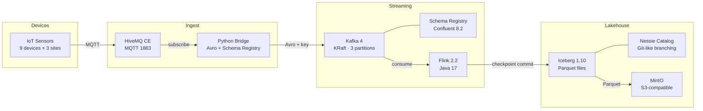

# IoT Lakehouse — Flink + Iceberg

End-to-end streaming lakehouse for IoT telemetry: MQTT sensors feed Kafka via a Schema Registry bridge, Flink streams the data into Apache Iceberg tables on S3-compatible storage, queryable from any SQL engine.

## Architecture



**Data flow:** Simulated IoT devices publish JSON readings over MQTT to HiveMQ. A Python bridge subscribes, serializes to Avro via Schema Registry, and produces to Kafka (keyed by `device_id`). Flink consumes the Avro stream, maps records to Iceberg RowData, and sinks Parquet files to MinIO through the Nessie catalog. Every Flink checkpoint triggers an Iceberg commit — the table is always consistent.

## Run the full pipeline locally

**Prerequisites:** Docker (with Compose), Java 17, Maven, Python 3.10+.

```bash
# 1. Start the stack (Kafka KRaft self-bootstraps; minio-init creates the warehouse bucket)
cd docker && docker compose up -d

# 2. Create the Kafka topic
docker exec kafka kafka-topics \
  --bootstrap-server localhost:9092 --create --if-not-exists \
  --topic iot.telemetry --partitions 3 --replication-factor 1

# 3. Build the Flink fat jar
cd ../flink-jobs && MAVEN_OPTS="-Xmx3g" mvn clean package -DskipTests

# 4. Install Python dependencies
cd ../sample-data && pip install -r requirements.txt

# 5. Start the simulator and bridge (two terminals)
python3 sensor_simulator.py --rate-hz 5
python3 mqtt_kafka_bridge.py

# 6. Submit the Flink job
docker cp ../flink-jobs/target/iot-lakehouse-flink-0.1.0-SNAPSHOT.jar \
  docker-flink-jobmanager-1:/tmp/job.jar
docker exec docker-flink-jobmanager-1 flink run -d /tmp/job.jar
```

After ~30 seconds the first checkpoint commits and Iceberg rows appear on MinIO:

```bash
# Verify Kafka offsets
docker exec kafka kafka-get-offsets \
  --bootstrap-server localhost:9092 --topic iot.telemetry

# Browse Iceberg table files on MinIO
docker run --rm --network docker_lakehouse --entrypoint sh minio/mc:latest -c \
  "mc alias set local http://minio:9000 admin admin12345 >/dev/null && \
   mc ls --recursive local/warehouse/iot/"
```

## Why this stack

| Choice | Rationale |
|--------|-----------|
| **Kafka 4 (KRaft)** | No ZooKeeper dependency — single-process combined controller+broker. Simpler ops, matches the direction all new Kafka deployments are heading. |
| **Confluent Platform 8.2** | Provides Schema Registry + production-grade Kafka images. Avro schema is the single contract between the Python bridge and the Java Flink job. |
| **Flink 2.2 on Java 17** | Long Term Support release. Native Iceberg sink with checkpoint-driven commits — no custom logic for exactly-once delivery to the table. |
| **Iceberg 1.10** | Open table format with ACID guarantees, schema evolution, and time travel. Decouples storage from compute — any SQL engine can read the table. |
| **Nessie** | Git-like catalog branching for the Iceberg table. Locally simulates what Glue or Unity Catalog provide in cloud deployments. |
| **MinIO** | S3-compatible object storage for local development. Iceberg's `S3FileIO` talks to it identically to real S3. |
| **HiveMQ CE** | Production-grade MQTT broker (not Mosquitto). CE is free; the protocol layer is identical to Enterprise for basic pub/sub. |
| **Smooth Gaussian-walk sensor values** | Synthetic data with realistic drift so a downstream anomaly-detection project has a stable baseline to learn against. |

## Operational characteristics

| Metric | Observed at M3 |
|--------|---------------|
| End-to-end lossless delivery | 57,042 Kafka offsets = 57,042 Iceberg rows (exact match across `kafka-get-offsets`, Iceberg snapshot `total-records`, and `pyarrow` row count) |
| Checkpoint interval | 30 s (configurable) |
| Iceberg commit trigger | Every successful Flink checkpoint |
| Fat jar size | ~151 MB (Iceberg + AWS bundle dominates; slimming deferred) |
| Simulator throughput | 9 devices × 5 Hz = 45 msgs/s sustained |

## Repository layout

| Directory | Purpose |
|-----------|---------|
| `docker/` | docker-compose stack: HiveMQ, Kafka (KRaft), Schema Registry, MinIO + `minio-init` bootstrap, Nessie, Flink JM+TM |
| `sample-data/` | Python MQTT sensor simulator + Avro bridge (Confluent SR) |
| `flink-jobs/` | Maven module: `KafkaToIcebergJob` reads Avro from SR, maps to RowData, sinks Parquet via Nessie catalog |
| `flink-jobs/src/main/avro/telemetry.avsc` | Single source of truth for the on-the-wire schema |

## Honest disclaimer

| Feature | Status | Notes |
|---------|--------|-------|
| MQTT → Kafka → Flink → Iceberg pipeline | **Real, working** | Verified lossless at 57K rows |
| Kafka 4 KRaft (no ZooKeeper) | **Real** | Single-node; multi-broker config is documented but not exercised |
| Iceberg table with Parquet on MinIO | **Real** | Append-only; upsert, schema evolution, and time travel are planned |
| Avro wire format via Schema Registry | **Real** | Protobuf migration is planned |
| Sensor simulator | **Illustrative** | Synthetic Gaussian-walk data; not a real device fleet |
| Healthchecks per service | **Planned** | Services run but `docker compose ps` does not yet report `healthy` |
| Monitoring (Prometheus + Grafana) | **Planned** | Not yet wired |
| CI pipeline | **Planned** | No `.github/workflows/` yet |
| DLQ (dead-letter queue) | **Planned** | Deserialization failures currently crash the job |

## Roadmap

- **Protobuf wire format** — replace Avro with `proto/telemetry.proto` as schema source of truth
- **Iceberg upsert + ACID** — equality-delete upsert on `(device_id, ts)`
- **Schema evolution** — add optional fields, prove backward-compatible reads
- **Flink state + exactly-once** — RocksDB backend, S3 checkpoints, savepoints
- **Time travel** — pyiceberg scripts demonstrating snapshot queries
- **Kafka best practices** — DLQ topic, `acks=all`, idempotent producer, `min.insync.replicas`
- **Monitoring** — Prometheus + Grafana dashboards for throughput, lag, checkpoint duration
- **CI** — GitHub Actions with Maven build + Testcontainers integration tests

## License

[MIT](LICENSE)
